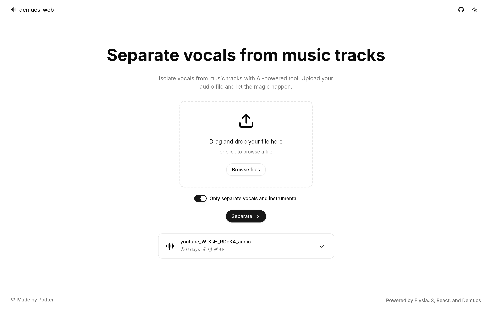

<!DOCTYPE html>
<html lang="en">
<head>
    <meta charset="UTF-8">
    <meta name="viewport" content="width=device-width, initial-scale=1.0">
    <title>DeepSplit Audio - README</title>
    
</head>
<body>
    

        <!-- Language Switcher -->
        

            <button class="language-btn active" onclick="switchLanguage('en')">English</button>
            <button class="language-btn" onclick="switchLanguage('zh')">中文</button>
        

        <!-- English Section -->
        

            <h1>DeepSplit Audio</h1>
            
            
            
            <h2>Project Introduction</h2>
            
DeepSplit Audio is an AI-powered web application that allows users to separate audio tracks into individual components such as vocals, drums, bass, and other instruments. Built with modern web technologies, it provides a user-friendly interface for high-quality audio separation using state-of-the-art models.

            
            <h2>Features</h2>
            

                

                    <h3>AI-Powered Separation</h3>
                    
Utilizes advanced Demucs models for high-quality audio separation

                

                

                    <h3>Multiple Models</h3>
                    
Supports various models with different speed and quality trade-offs

                

                

                    <h3>Two Separation Modes</h3>
                    
Vocals + Background music separation or full instrumental separation

                

                

                    <h3>Responsive Design</h3>
                    
Works seamlessly on desktop and mobile devices

                

                

                    <h3>Multi-language Support</h3>
                    
Supports English and Chinese languages

                

                

                    <h3>Real-time Progress</h3>
                    
Shows processing progress and allows closing the browser

                

            

            
            <h2>Technology Stack</h2>
            

                React
                TypeScript
                ElysiaJS
                Bun
                Vite
                Tailwind CSS
                Demucs
                SQLite
                Docker
            

            
            <h2>Quick Start</h2>
            <h3>Prerequisites</h3>
            <ul>
                <li>Bun (v1.0+)</li>
                <li>Node.js (v18+ if not using Bun)</li>
                <li>Docker (for containerized deployment)</li>
            </ul>
            
            <h3>Installation</h3>
            <pre><code># Clone the repository
git clone https://github.com/qishiyou/DeepSplit-Audio.git
cd DeepSplit-Audio

# Install dependencies
bun install
</code></pre>
            
            <h3>Running the Application</h3>
            <pre><code># Start the development server
bun dev

# Open your browser and navigate to
# http://localhost:3000
</code></pre>
            
            <h2>Usage</h2>
            <h3>Step 1: Upload Audio File</h3>
            
Drag and drop your audio file into the upload area or click to browse files. Supported formats include MP3, WAV, FLAC, and more.

            
            <h3>Step 2: Choose Separation Mode</h3>
            <ul>
                <li><strong>Vocals + Background Music</strong>: Separates the audio into two tracks - vocals and instrumental music</li>
                <li><strong>Full Instrumental Separation</strong>: Separates the audio into individual instruments (drums, bass, other)</li>
            </ul>
            
            <h3>Step 3: Select Model and Quality</h3>
            
Choose the appropriate model based on your needs:

            <ul>
                <li><strong>htdemucs_6s</strong>: Very fast, lower quality</li>
                <li><strong>htdemucs</strong>: Fast, balanced quality</li>
                <li><strong>htdemucs_ft</strong>: High quality, slower</li>
                <li><strong>mdx_extra_q</strong>: Ultra high quality, slowest</li>
            </ul>
            
            <h3>Step 4: Start Separation</h3>
            
Click the "Separate" button to start the separation process. The processing time depends on the length of the audio file and the model chosen.

            
            <h3>Step 5: Download Results</h3>
            
Once processing is complete, you can listen to and download the separated tracks.

            
            <h2>Deployment</h2>
            <h3>Docker Compose (Recommended)</h3>
            
Create a <code>.env</code> file with the following variables:

            <pre><code>SECRET=your-secret-key
DEMUCS_API=http://your-demucs-api-url
DEMUCS_API_KEY=your-demucs-api-key (optional)
</code></pre>
            
            
Then run:

            <pre><code>docker compose up -d --build
</code></pre>
            
            <h3>Manual Deployment</h3>
            <h4>1. Deploy the Demucs Server</h4>
            <pre><code>cd demucs
python server.py
</code></pre>
            
            <h4>2. Build the Web Application</h4>
            <pre><code># Build the client
bun run build:client

# Build the server
bun run build:server

# Start the server
bun preview
</code></pre>
            
            <h2>Development</h2>
            <h3>Directory Structure</h3>
            <pre><code>├── src/
│   ├── components/       # React components
│   ├── db/              # Database configuration and schema
│   ├── html/            # HTML pages and templates
│   ├── i18n/            # Internationalization files
│   ├── lib/             # Utility functions
│   ├── routes/          # API routes
│   └── main.ts          # Application entry point
├── demucs/              # Demucs audio separation server
├── public/              # Static assets
└── scripts/             # Build and deployment scripts
</code></pre>
            
            <h3>Development Commands</h3>
            <pre><code># Start development server
bun dev

# Type check
bun run typecheck

# Lint
bun run lint

# Format code
bun run format

# Build for production
bun run build
</code></pre>
            
            <h2>Contributing</h2>
            
Contributions are welcome! Please follow these steps:

            <ol>
                <li>Fork the repository</li>
                <li>Create a new branch (<code>git checkout -b feature/your-feature</code>)</li>
                <li>Make your changes</li>
                <li>Test your changes</li>
                <li>Commit your changes (<code>git commit -m 'Add some feature'</code>)</li>
                <li>Push to the branch (<code>git push origin feature/your-feature</code>)</li>
                <li>Open a Pull Request</li>
            </ol>
            
            <h2>License</h2>
            
This project is licensed under the MIT License. See the <a href="LICENSE">LICENSE</a> file for more information.

            
            <h2>Contact</h2>
            
For questions or feedback, please open an issue on GitHub or contact the project maintainer.

        

        <!-- Chinese Section -->
        

            <h1>DeepSplit Audio</h1>
            
            
            
            <h2>项目介绍</h2>
            
DeepSplit Audio 是一个基于 AI 的音频分离 Web 应用程序，允许用户将音频轨道分离为人声、鼓、贝斯和其他乐器等单独组件。它使用现代 Web 技术构建，提供了一个用户友好的界面，使用最先进的模型进行高质量音频分离。

            
            <h2>功能特性</h2>
            

                

                    <h3>AI 驱动的分离</h3>
                    
利用先进的 Demucs 模型进行高质量音频分离

                

                

                    <h3>多种模型</h3>
                    
支持各种模型，具有不同的速度和质量权衡

                

                

                    <h3>两种分离模式</h3>
                    
人声+背景音乐分离或完整乐器分离

                

                

                    <h3>响应式设计</h3>
                    
在桌面和移动设备上无缝工作

                

                

                    <h3>多语言支持</h3>
                    
支持英语和中文

                

                

                    <h3>实时进度</h3>
                    
显示处理进度，允许关闭浏览器

                

            

            
            <h2>技术栈</h2>
            

                React
                TypeScript
                ElysiaJS
                Bun
                Vite
                Tailwind CSS
                Demucs
                SQLite
                Docker
            

            
            <h2>快速开始</h2>
            <h3>前置条件</h3>
            <ul>
                <li>Bun (v1.0+)</li>
                <li>Node.js (v18+，如果不使用 Bun)</li>
                <li>Docker (用于容器化部署)</li>
            </ul>
            
            <h3>安装</h3>
            <pre><code># 克隆仓库
git clone https://github.com/qishiyou/DeepSplit-Audio.git
cd DeepSplit-Audio

# 安装依赖
bun install
</code></pre>
            
            <h3>运行应用</h3>
            <pre><code># 启动开发服务器
bun dev

# 打开浏览器并导航到
# http://localhost:3000
</code></pre>
            
            <h2>使用说明</h2>
            <h3>步骤 1: 上传音频文件</h3>
            
将音频文件拖放到上传区域或点击浏览文件。支持的格式包括 MP3、WAV、FLAC 等。

            
            <h3>步骤 2: 选择分离模式</h3>
            <ul>
                <li><strong>人声 + 背景音乐</strong>: 将音频分离为两个轨道 - 人声和器乐</li>
                <li><strong>完整乐器分离</strong>: 将音频分离为单独的乐器（鼓、贝斯、其他）</li>
            </ul>
            
            <h3>步骤 3: 选择模型和质量</h3>
            
根据您的需求选择合适的模型：

            <ul>
                <li><strong>htdemucs_6s</strong>: 非常快，质量较低</li>
                <li><strong>htdemucs</strong>: 快速，质量平衡</li>
                <li><strong>htdemucs_ft</strong>: 高质量，较慢</li>
                <li><strong>mdx_extra_q</strong>: 超高质量，最慢</li>
            </ul>
            
            <h3>步骤 4: 开始分离</h3>
            
点击 "分离" 按钮开始分离过程。处理时间取决于音频文件的长度和选择的模型。

            
            <h3>步骤 5: 下载结果</h3>
            
处理完成后，您可以收听并下载分离后的轨道。

            
            <h2>部署</h2>
            <h3>Docker Compose (推荐)</h3>
            
创建一个 <code>.env</code> 文件，包含以下变量：

            <pre><code>SECRET=your-secret-key
DEMUCS_API=http://your-demucs-api-url
DEMUCS_API_KEY=your-demucs-api-key (可选)
</code></pre>
            
            
然后运行：

            <pre><code>docker compose up -d --build
</code></pre>
            
            <h3>手动部署</h3>
            <h4>1. 部署 Demucs 服务器</h4>
            <pre><code>cd demucs
python server.py
</code></pre>
            
            <h4>2. 构建 Web 应用</h4>
            <pre><code># 构建客户端
bun run build:client

# 构建服务器
bun run build:server

# 启动服务器
bun preview
</code></pre>
            
            <h2>开发</h2>
            <h3>目录结构</h3>
            <pre><code>├── src/
│   ├── components/       # React 组件
│   ├── db/              # 数据库配置和 schema
│   ├── html/            # HTML 页面和模板
│   ├── i18n/            # 国际化文件
│   ├── lib/             # 工具函数
│   ├── routes/          # API 路由
│   └── main.ts          # 应用入口点
├── demucs/              # Demucs 音频分离服务器
├── public/              # 静态资源
└── scripts/             # 构建和部署脚本
</code></pre>
            
            <h3>开发命令</h3>
            <pre><code># 启动开发服务器
bun dev

# 类型检查
bun run typecheck

# 代码检查
bun run lint

# 格式化代码
bun run format

# 构建生产版本
bun run build
</code></pre>
            
            <h2>贡献</h2>
            
欢迎贡献！请按照以下步骤操作：

            <ol>
                <li>Fork 仓库</li>
                <li>创建一个新分支 (<code>git checkout -b feature/your-feature</code>)</li>
                <li>进行更改</li>
                <li>测试您的更改</li>
                <li>提交更改 (<code>git commit -m 'Add some feature'</code>)</li>
                <li>推送到分支 (<code>git push origin feature/your-feature</code>)</li>
                <li>打开 Pull Request</li>
            </ol>
            
            <h2>许可证</h2>
            
本项目采用 MIT 许可证。有关更多信息，请参阅 <a href="LICENSE">LICENSE</a> 文件。

            
            <h2>联系方式</h2>
            
如有问题或反馈，请在 GitHub 上打开 issue 或联系项目维护者。

        

    

    
</body>
</html>
